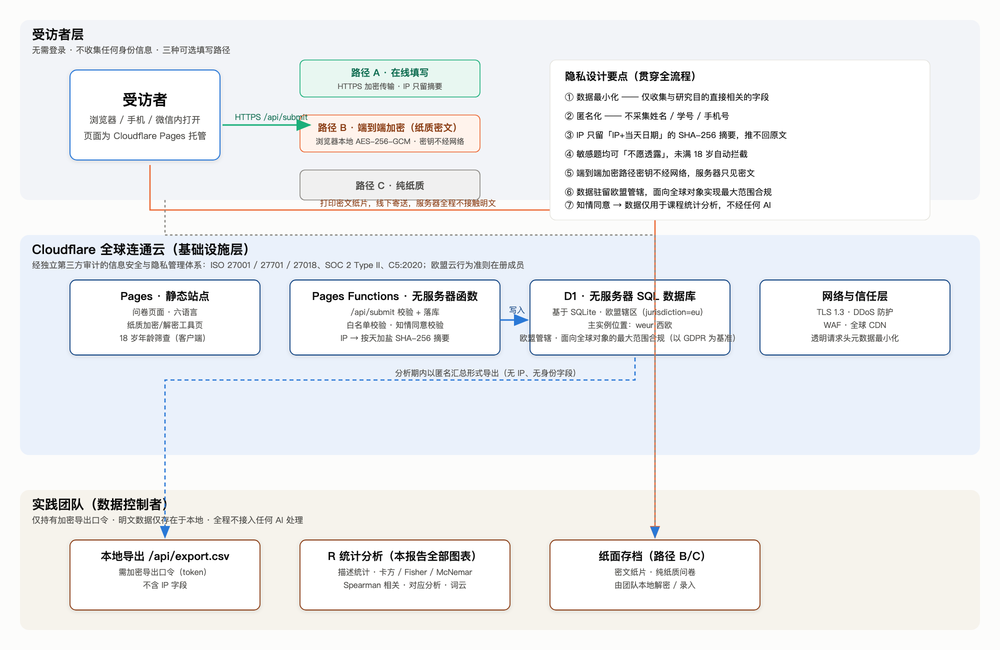
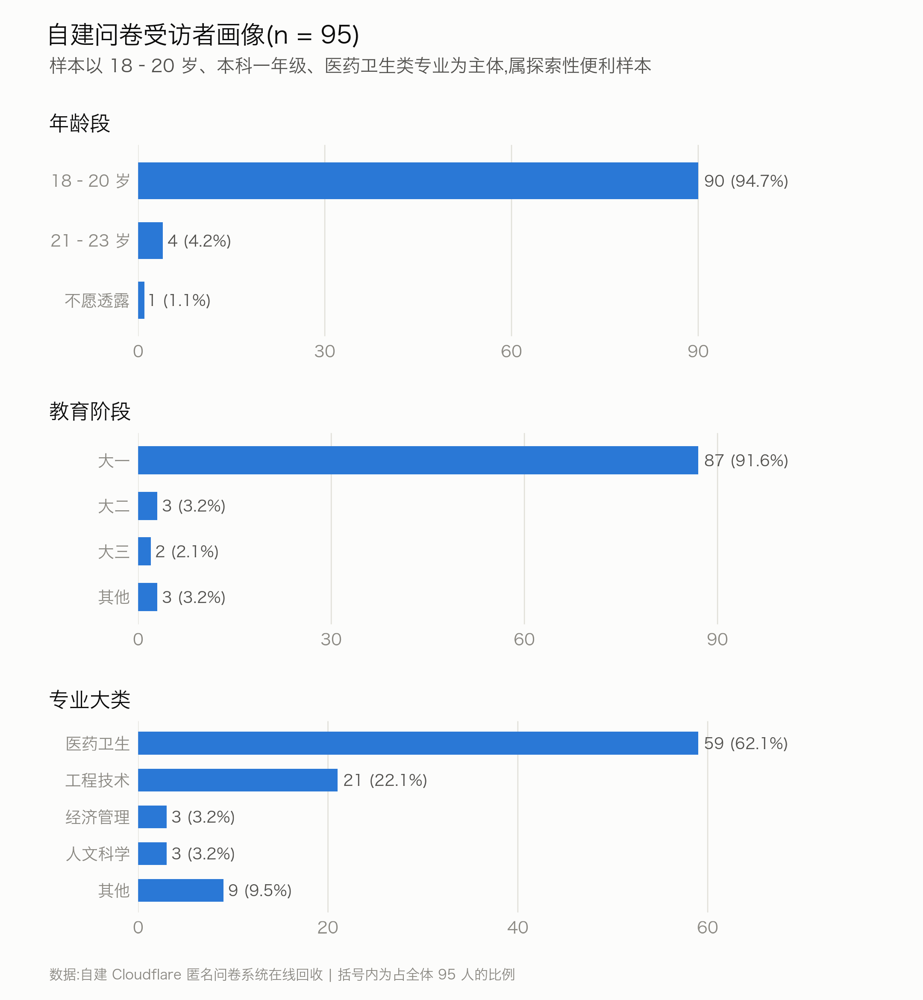
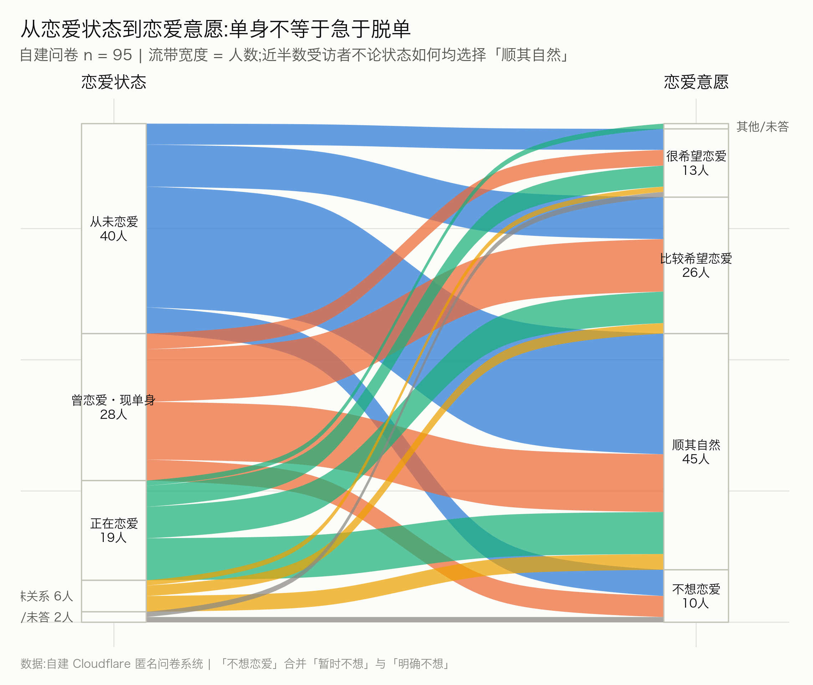
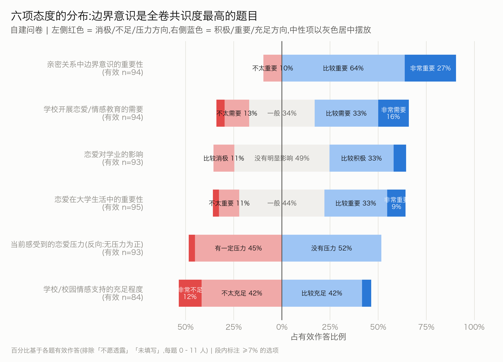
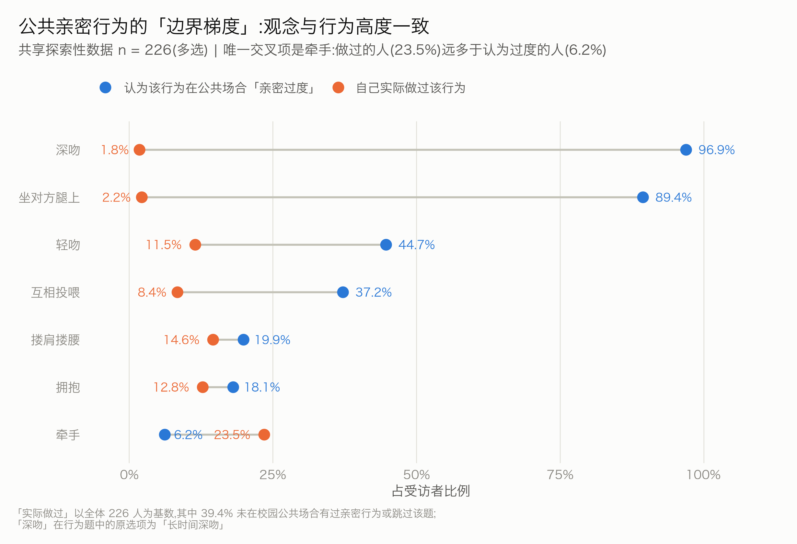
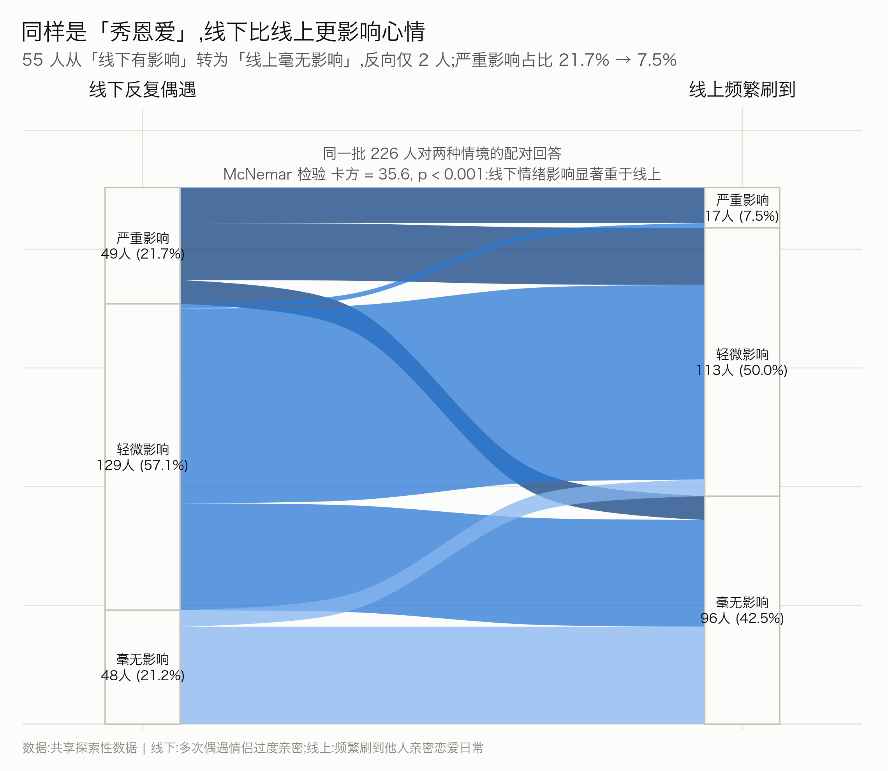
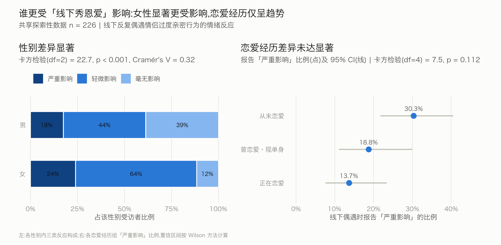
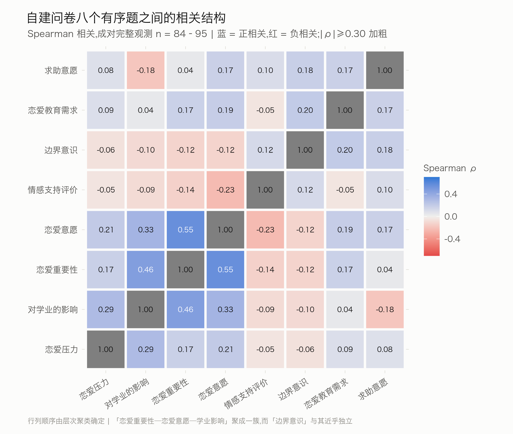
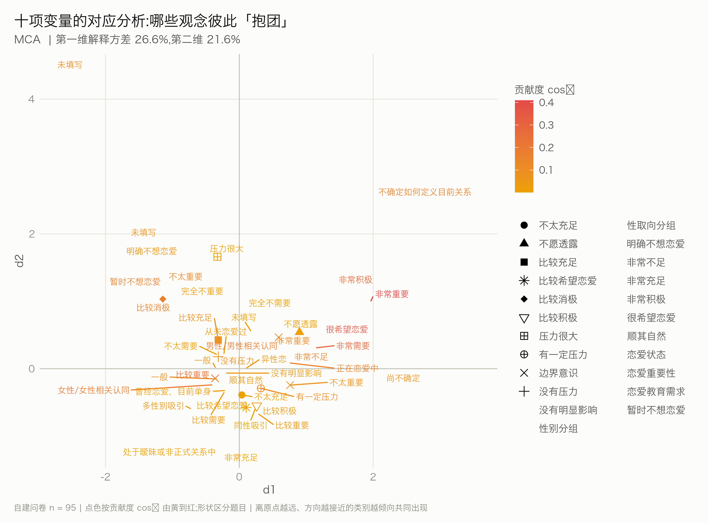
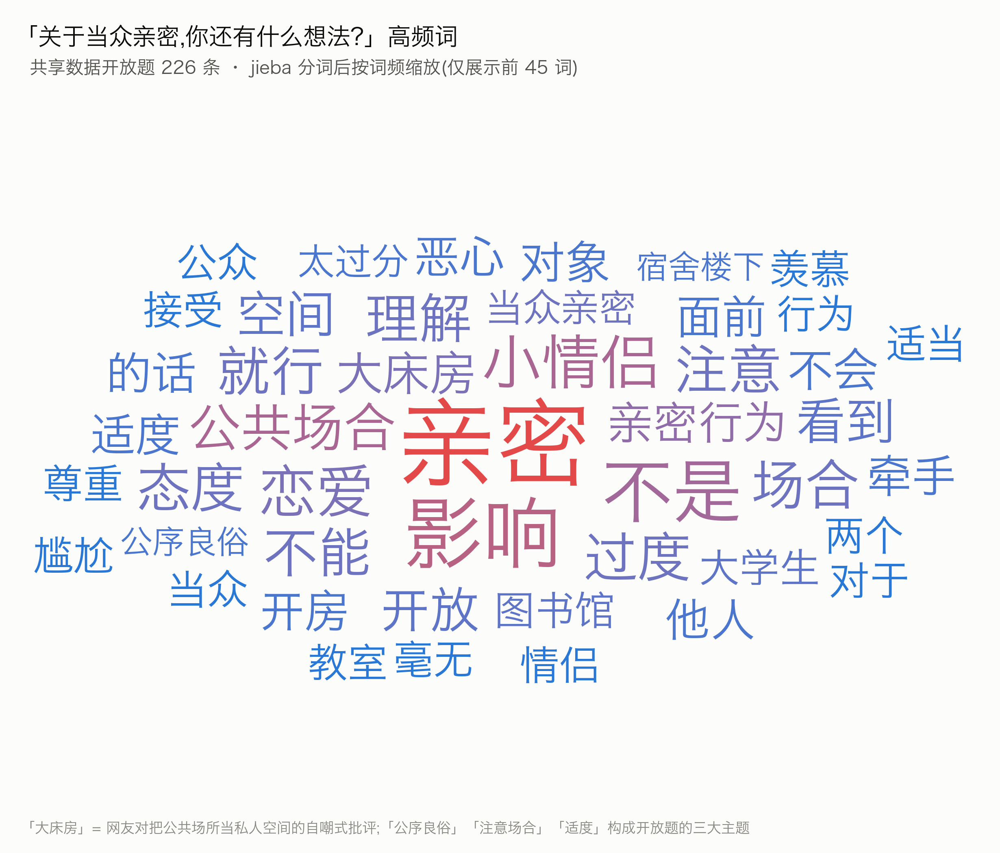

# 高校大学生恋爱现状与公共亲密边界认知调查

**——基于自建隐私优先问卷系统的混合渠道调查与分析**

---

## 摘要

本社会实践围绕"高校大学生恋爱现状"与"公共场合中的亲密边界"两个相互关联的议题展开。问卷涉及性别认同、性取向、恋爱经历与情感压力等敏感内容，团队因此在立项阶段确立了一条原则：数据收集以受访者知情、自愿和隐私保护为前提，不以提高回收速度或样本量为由降低这一标准。基于这一考虑，团队没有采用第三方商业问卷平台，而是自行设计并搭建了一套匿名问卷系统，把隐私保护落实到数据采集、存储与导出的具体环节。

主调查通过自建系统在线回收（填写地址 https://surveycmu.66110721.xyz ，系统代码公开于 https://github.com/guodayi-cmu/survey-cloudflare ），获得有效问卷 95 份。为在具体情境中观察"公共亲密边界"，另引入一套独立共享的探索性数据 226 份。两套数据的题目、来源与抽样过程均不相同，分析时始终分别处理，不合并为同一个 321 人样本，仅在讨论层面对相近现象作参照。

主要结果如下。主调查样本中正在恋爱者占 20.0%，47.4% 对恋爱持"顺其自然"态度，89.5% 认为亲密关系中的"边界意识"比较重要或非常重要。共享数据呈现出清晰的公共亲密行为接受度梯度：认为公共场合"深吻"过度者占 96.9%，认为"牵手"过度者仅占 6.2%。同一批 226 名受访者对线下与线上情境的回答存在统计学差异：线下反复遇到过度亲密行为时 78.8% 报告心情受到不同程度影响，线上频繁刷到相关内容时该比例为 57.5%（配对 McNemar 检验，p < 0.001）。

在方法上，团队把"隐私保护"和"结论不过度外推"落为可检查的具体做法。采集端不收集姓名、学号、手机号等直接身份信息，敏感题设置"不愿透露"选项，并提供不同信任级别的填写路径；涉及境外存储时，在知情同意中单独说明数据传输与处理安排。分析端坚持两套数据分别处理，对横断面数据不作因果推断。主样本以低年级医学生为主（18—20 岁占 94.7%，本科一年级占 91.6%，医药卫生类专业占 62.1%），属探索性便利样本，结论用于描述本次样本，不推广至全国大学生。全部统计检验与可视化使用 R 完成，核心分析代码经脱敏后附于文末，便于复核。

**关键词**：大学生恋爱观；亲密关系边界；公共空间；隐私保护设计；匿名问卷系统

### 小礼一则：以礼观之

> 尝闻：人与人相交，难在知之多，尤难在知其所不当问。恋爱之历、情感之困、性别与取向，本属心门以内之事；若只为一纸课业，便欲姓名、学号、来路一并收尽，是以求数之名，行窥私之实也。
>
> 故宁多费工夫，自筑问卷之门：不取姓名学号，不留明文来路，敏感之问亦许人不答。所得自采之卷九十有五，又取独立共享之卷二百二十六，分途参照，不敢混为一池，但求彼此印证而各守其名。
>
> 由是观之：恋爱可以随缘，公共之礼不可无界；数据固然可贵，人之私隐尤不可拿来凑数。若但求图表工整，而以他人私事铺陈案前，则统计虽精，其礼先失矣。

---

## 一、实践背景与选题缘起

### 1.1 选题依据

恋爱与亲密关系是大学生活中的常见话题，也容易引发讨论。已有研究指出，大学生的恋爱动机与交往方式呈现多元化特征[1]，在婚恋态度和择偶标准上更重视个人感受与内在品质[2]。与此同时，网络语境中"不婚不育""恋爱脑""分手自由"等表达并存，反映出年轻人对亲密关系并无单一立场。仅用"是否恋爱""是否想恋爱"两个维度描述这一群体，难以覆盖关系边界、情感压力、公共空间中的行为规范以及校园情感支持等更具体的问题。

### 1.2 选题的形成过程

课程通知给出的参考选题是"高校大学生恋爱现状调研"，团队最初只计划设计一份围绕恋爱状态与恋爱态度的常规问卷。《中长期青年发展规划（2016—2025年）》提出加强青年婚恋观、家庭观教育与引导[3]，说明这一议题具有现实意义。但在具体设计过程中，团队意识到问卷会涉及恋爱经历、性取向与情感压力等私人内容；若只关注回收份数，而不认真处理知情同意和数据安全，调查本身即存在伦理缺口。

选题的扩展来自校园生活中的一个具体观察：图书馆、教学楼与宿舍楼下等公共空间中的情侣亲密行为，经常成为同学间讨论的话题，网络上亦有类似争议。团队由此把"恋爱现状"与"公共场合亲密边界"联系起来，不仅关注受访者"谈不谈恋爱"，也关注他们如何理解亲密关系中的边界，以及这种边界进入公共空间后发生的变化。调查最终形成"恋爱现状 + 亲密边界认知"两条主线，并拆分为三个核心问题。

1. 当代大学生真实的恋爱状态、意愿与压力是什么样？
2. 大学生所说的亲密关系"边界"到底落在哪里？
3. 当亲密行为进入公共空间（尤其是线上与线下的对比），大学生的真实观感如何？

### 1.3 一个额外的决定：自建问卷系统

问卷内容确定后，团队首先遇到的不是统计问题，而是数据由谁保管的问题。使用第三方问卷平台虽然方便，但其数据处理流程、日志字段和后端存储并不完全由调查团队控制。考虑到问卷涉及敏感内容，团队决定自行搭建系统，把需要收集的字段、数据流向和访问方式控制在可检查的范围内。

这一选择增加了开发和维护成本，但使团队能够逐项决定"收集什么、不收集什么、谁可以访问、数据保存多久"，从而把隐私保护前移到问卷设计与系统实现阶段，而不是在数据收集完成后再作补救。

---

## 二、调查工具的自研决策与架构设计

### 2.1 需求分析

围绕"隐私优先"的目标，团队为问卷系统确定了七条设计需求。

| # | 需求 | 设计含义 |
|---|------|---------|
| 1 | 匿名化 | 不采集姓名、学号、手机号等任何直接身份信息 |
| 2 | 数据最小化 | 仅收集与研究目的直接相关的字段 |
| 3 | 年龄筛查 | 未满 18 周岁自动拦截，不进入问卷 |
| 4 | 敏感题可跳过 | 性别认同、性取向等均设"不愿透露"选项 |
| 5 | 知情同意 | 填写前必须阅读并确认同意条款 |
| 6 | 多信任级别填写渠道 | 在线 / 端到端加密 / 纯纸质三选一 |
| 7 | 数据可控 | 原始数据仅由团队本地导出，不接入任何 AI 处理 |

### 2.2 架构设计

基于上述需求，团队设计了如图 1 所示的系统架构。



图 1　自建匿名问卷系统的架构与数据流。受访者经三种路径之一提交数据；所有在线请求经过 Cloudflare 全球网络的 TLS 加密与防护；Pages Functions 完成校验与匿名化处理后写入 D1；数据库主实例驻留欧洲；团队以加密导出口令导出匿名汇总数据，再用 R 完成统计分析。

架构的核心是把"谁能在哪个环节看到什么"界定清楚。

- **路径 A（在线填写）**：受访者在浏览器中直接填写，数据经 HTTPS 加密传输至 Cloudflare 边缘，由 Pages Functions 完成白名单校验、知情同意校验与年龄校验后写入 D1。该路径下服务器可见已提交的问卷内容，但 IP 地址不落明文；服务端只保留由"IP + 当天日期"计算出的 SHA-256 摘要，仅用于拦截同一天的重复提交。
- **路径 B（端到端加密）**：面向信任层级要求最高的受访者。问卷页面在浏览器本地以 AES-256-GCM 加密后打印成密文纸片，密钥只在本地生成、从不经过网络；受访者将密文纸片线下寄送，团队在本地解密。该路径下服务器全程不接触明文，数据库中只存密文。
- **路径 C（纯纸质）**：完全线下填写，由团队手工录入，规避一切网络环节。

### 2.3 技术选型：为什么选择 Cloudflare

在基础设施选型时，团队比较了自行维护服务器、国内云服务与 Cloudflare 三类方案，最终选择 Cloudflare，主要基于以下四点考虑。

1. **安全与隐私控制具备可核查的第三方材料。** Cloudflare Trust Hub 公开列有 ISO 27001、ISO 27701、ISO 27018、ISO 27017 与 SOC 2 Type II 等认证或鉴证材料[9]。这些材料不能替代团队自身的数据保护措施，但使平台的部分安全与隐私控制具有外部审计依据，而非仅依赖厂商自述。
2. **数据披露政策相对透明。** Cloudflare 持续发布透明度报告，披露其收到的政府及其他主体的数据请求，并公开说明其在加密密钥、执法软件部署与客户流量提供等方面的政策与历史记录[10]。团队因此能够在选型前核查平台如何描述其数据披露边界，而不是完全依赖不可见的内部规则。
3. **与欧盟数据保护框架存在明确的合规衔接。** Cloudflare 表示其多项服务已通过 EU Cloud Code of Conduct 的合规验证，D1 亦列在其公开范围内[11]。这为理解平台在 GDPR 下的数据处理责任提供了较明确的公开依据，但不意味着使用这些服务即可替代调查团队应履行的告知、同意与最小化义务。
4. **数据位置可以被明确配置。** Cloudflare D1 同时提供 `weur`（Western Europe）等 location hint 与 `jurisdiction=eu` 辖区限制两类机制。官方文档指出，location hint 只表示优先位置，并不保证数据库一定在该位置运行；`jurisdiction=eu` 才限制数据库仅在欧盟范围内运行和存储，且一旦设置 jurisdiction，location hint 将被忽略[12]。**本项目在创建 D1 时指定了 `weur` 位置提示，未启用 `jurisdiction=eu`**，因此全文统一表述为"西欧位置提示"，不写作"数据保证仅在欧盟境内存储"。

报告中 Pages、D1、Turnstile、location hint 与 jurisdiction 等名称均沿用 Cloudflare 官方文档中的产品或配置术语，以免自行翻译造成技术含义偏差。

需要指出的是，云服务商取得认证并不意味着本调查的数据处理当然符合法律要求。《个人信息保护法》对敏感个人信息处理、告知同意以及向境外提供个人信息分别提出了要求[13]。团队因此把平台认证视为基础设施层面的参考，而把数据最小化、敏感题可跳过、访问控制、保存期限与单独告知等措施落实在自己的问卷设计与代码中。对一份涉及私人经历的学生调查而言，这些具体措施比笼统宣称"平台安全"更有意义。

### 2.4 数据保护框架的整体设计与跨境告知

把前述设计放在一起看，本项目形成了四个相互衔接的数据保护层面。这里使用"数据保护框架"而非"已实现全面合规"，因为学生课程调查不能仅凭技术选型对法律合规作出完整认定。

**第一层，基础设施层。** Cloudflare 公开提供 ISO 27001、ISO 27701、ISO 27018、ISO 27017 与 SOC 2 Type II 等认证或鉴证材料[9]，使团队能够对平台的部分安全与隐私控制进行外部核查。

**第二层，数据位置设置。** 本项目采用 D1 的 `weur` location hint，即西欧优先位置，而非 `jurisdiction=eu` 辖区限制（两类机制的区别见 2.3）。在制度参照上，团队主要参考 GDPR 所体现的数据最小化、透明度与数据主体权利等原则，不使用"全球最严格""自动满足所有地区要求"这类难以验证的绝对表述。

**第三层，应用层控制。** 包括数据最小化、不采集直接身份信息、IP 摘要化、敏感题可跳过、知情同意以及加密填写路径。这些措施由项目代码和问卷流程直接实现，而不由云平台代劳。

**第四层，跨境传输的单独告知。** 《个人信息保护法》第三十九条规定，个人信息处理者向境外提供个人信息时，应告知境外接收方、处理目的、处理方式、个人信息种类以及权利行使方式等事项，并取得个人的单独同意；国家互联网信息办公室 2026 年发布的政策问答亦强调，单独同意不应与其他处理活动捆绑[13-14]。据此，团队在知情同意环节将跨境传输说明与总体调查同意分开设置，告知文本中的存储位置描述与实际采用的 `weur` 位置提示保持一致。

四个层面共同构成本项目的数据保护设计：平台选择提供基础能力，数据位置设置明确存储策略，应用代码限制不必要的数据收集，知情同意保障受访者在填写前获得必要信息。

知情同意书还说明了调查团队的联系邮箱、数据保存期限，以及受访者申请查询、更正、删除或撤回同意的方式。原始数据计划在课程作业完成并提交报告后删除。对于法律适用与争议处理条款，本报告仅记录问卷中的告知内容，不据此对其法律效力作进一步判断。

---

## 三、系统的真实构建过程

这一节记录团队构建这套系统的实际过程，包括其中遇到的问题。系统全部代码开源于 GitHub（https://github.com/guodayi-cmu/survey-cloudflare ），基于 Cloudflare Pages + D1 实现，含全部前端页面、接口与数据库迁移脚本，审查者可在公开仓库中核对数据流与隐私设计是否与本报告所述一致。

### 3.1 里程碑

| 阶段 | 内容 |
|------|------|
| 1. 原型 | 用 Cloudflare Pages + Functions 搭出最小可提交问卷，跑通"填写 → 落库 → 导出" |
| 2. 隐私改造 | 加入知情同意、18 岁筛查、敏感题"不愿透露"、匿名导出 |
| 3. 多语言 | 实现简体中文、繁体中文（香港）、繁体中文（台湾）、English、日本語、한국어 六语言界面 |
| 4. 端到端加密路径 | 编写浏览器本地 AES-256-GCM 加密 / 解密页，密文打印 + 线下寄送流程 |
| 5. 反滥用 | 接入 Turnstile 人机验证（后因可及性问题移除，见 3.2）；服务端只保存由"IP + 当天日期"算出的摘要，用于防重复提交 |
| 6. 数据驻留 | 创建 D1 时指定 `weur` 西欧位置提示，面向全球受访者开放 |
| 7. 上线与回收 | 经朋友圈、微信群与线下渠道推广，回收主调查数据 95 份 |

### 3.2 构建过程中的问题与反思

**问题一：Turnstile 验证与填写可及性的冲突。** 团队最初在提交接口接入 Cloudflare Turnstile，希望减少机器人或重复提交。但实际测试中，部分同学在校园网或微信内置浏览器中无法顺利完成验证，正常提交因此受阻。考虑到本调查规模较小，团队最终取消了提交前的强制验证，改为服务端字段校验，并辅以匿名化 IP 摘要拦截当日重复提交。这一过程说明，反滥用措施并非越多越好，需要同时权衡安全性与真实受访者的填写成本。

**问题二：IP 字段一度与隐私承诺不一致。** 在设计重复提交拦截时，团队最初对 IP 计算了 SHA-256 摘要，但请求头元数据中仍保留了 `CF-Connecting-IP` 与 `X-Forwarded-For` 的原始值。这意味着即使另有哈希字段，数据库中仍然存在明文 IP，与"不保存明文 IP"的设计目标相矛盾。上线前自查发现后，团队删除了这些字段的持久化，仅保留用于当日防重复的摘要。这一问题说明，隐私保护不能只看"有没有加密或哈希"，还要逐字段检查原始信息是否在其他位置被重复保存。相关修复已反映在公开代码中。

**问题三：多语言界面下的数据编码必须保持一致。** 六种语言界面会让同一选项呈现不同文本，后端若直接保存显示文本，将给后续统计带来额外映射甚至误分类风险。为此，团队为每个选项设置固定枚举键，语言切换只改变展示文本，不改变提交值，从而保证不同语言版本的主调查使用同一套编码。这一设计只解决主调查内部的编码一致性；共享数据来自另一份独立问卷，其统计口径是否可比仍需逐项核对。

### 3.3 多语言化

问卷对象不限于内地学生，团队为此提供了六种语言界面：简体中文、繁体中文（香港）、繁体中文（台湾）、英文、日文、韩文。

实现上，所有界面文案（题干、选项、按钮、提示语、知情同意条款）均置于独立的 JSON 语言文件中，页面运行时按所选语言加载，右上角提供语言切换器并记住选择。其中最关键的是上文问题三提到的枚举键设计：每个选项对应一个稳定的英文枚举键，语言切换只更换显示文本，不改变提交到后端的取值；不同语言作答的受访者，其回答在数据库中使用同一套标准，统计时无需再作映射。

多语言设计主要出于两点考虑。一是可及性，受访者以更熟悉的语言阅读题目，有助于减少因语言理解造成的偏差；二是知情同意的可理解性，同意条款只有在受访者能够理解其内容时才具有实际意义。因此团队把题目、选项与知情同意文本一并纳入多语言适配，而非只翻译问卷正文。本次调查未设置对照，因此不对多语言是否实际降低拒答率或提高回答真实性作效果性结论。

---

## 四、推广过程与社交平台的外链困境

### 4.1 推广渠道

系统上线后，团队主要依靠朋友圈与微信群扩散。成员先在各自朋友圈发布问卷说明，同时放置二维码与短链接（在线填写地址为 https://surveycmu.66110721.xyz ），再转发至班级群、社团群与老乡群，并请关系较好的同学接力转发。为照顾不习惯线上填写的同学，团队同步准备了纸质问卷，在课堂上与宿舍楼下发放一部分。

### 4.2 社交平台的外链限制

团队也尝试通过微博、小红书等公开社交平台扩大触达范围。实际发布中，带有外部网址的内容在展示、跳转或传播上受到一定限制，直接导流到自建问卷并不顺畅。为此团队尝试了三种替代方式。

- 将问卷二维码做成图片插入正文，文字中只说"扫码填问卷"，不出现网址；
- 引导私信或在评论区置顶获取链接；
- 使用"恋爱""大学生"等话题关键词争取自然流量。

三种方式的整体效果均有限。最终，95 份主调查数据主要来自朋友圈、微信群与线下渠道，公开社交平台带来的有效回收较少。这说明自建问卷提高了数据流程的可控性，但也牺牲了部分平台内传播便利。后续引入的 226 份共享探索性数据用于补充公共亲密边界的情境分析，而不是用来弥补主调查在代表性上的不足。

---

## 五、数据来源与研究方法

### 5.1 两套互不合并的数据

本报告使用两套相互独立的数据。

**主调查数据。** 由自建系统在线回收的《高校大学生恋爱现状调研问卷》，有效问卷 95 份。样本中 18—20 岁占 94.7%，本科一年级占 91.6%，医药卫生类专业占 62.1%，属以低年级医学生为主的探索性便利样本。主调查经朋友圈、微信群与线下渠道回收，共获得有效问卷 95 份。

**共享探索性数据。** 独立问卷《公共场合中情侣过分亲密行为：心理动机与大众观感（俗称：为啥你们要当我面亲）》，有效问卷 226 份（女性 64.6%，男性 35.4%）。该数据由其他高校同学通过交换方式提供，团队据此取得使用授权（同学间约定性质，非正式书面授权）。数据交付时仍含来源 IP 等记录，团队在分析前已作脱敏处理。

两套数据在来源、题目与样本构成上相互独立，因此不作个体层面的合并，也不视为同一个 321 人样本。主调查主要回答恋爱状态、恋爱态度与边界意识；共享数据用于把"公共亲密边界"放进更具体的行为与情境中观察。两者只能在概念与现象层面互相参照，不能通过简单合并来提高样本量。

### 5.2 统计方法

全部统计与可视化使用 R 完成，方法与对应图表如下。

| 方法 | 用途 | 对应图表 |
|------|------|---------|
| 描述性统计 + Wilson 95% 置信区间 | 各项比例的点估计与不确定性 | 图 2 / 图 4 / 图 5 |
| 冲积图（ggalluvial） | 恋爱状态 → 恋爱意愿的流动 | 图 3 |
| 配对 McNemar-Bowker 检验 | 同批 226 人线下 / 线上情绪影响差异 | 图 6 |
| 卡方检验 + Cramér's V | 性别、恋爱经历与情绪影响的关系 | 图 7 |
| Fisher 精确检验 | 小样本下的恋爱状态 × 压力 | 正文 |
| Spearman 相关 + 聚类排序热图 | 主调查八个有序题之间的关系结构 | 图 8 |
| 多重对应分析（MCA，FactoMineR） | 十项变量的多维共现结构 | 图 9 |
| 中文分词（jieba）+ 词云（ggwordcloud） | 开放题高频主题 | 图 10 |

所有数字均由原始数据逐项计算，核心分析代码已脱敏，附于文末供对照复现。

### 5.3 结论强度的统一约定

为避免在正文中逐处重复限定，本报告统一采用以下表述规则，后文不再单独说明。

- 两套数据均为便利抽样，所有比例仅描述本次样本，不推广至全国大学生；
- 横断面设计不支持因果推断，变量间关系一律表述为"相关""差异"或"趋势"；
- 未达统计学显著性（α = 0.05）的组间差异只描述为趋势，不作为结论；
- 涉及自评的题目（如恋爱对学业的影响）测量的是主观感受，不等同于客观结果；
- 报告统计量时一并给出检验统计量、自由度与 p 值，不使用"高度显著"一类程度副词。

---

## 六、调查结果

### 6.1 受访者画像



图 2　自建问卷受访者画像（n = 95）。样本高度集中于 18—20 岁（94.7%）、本科一年级（91.6%）、医药卫生类专业（62.1%），属探索性便利样本。共享数据样本以女性为主（64.6%）。

按提交时的网络位置记录，95 份主调查中有 93 份显示来自中国大陆，另有 2 份分别显示来自日本和美国，合计占 2.1%。网络位置不等同于受访者的国籍、常住地或实际身份，也可能受代理网络等因素影响，因此本报告仅将其作为技术层面的提交记录，不据此划分"国内 / 海外受访者"或作进一步比较。

### 6.2 恋爱现状：不是生活中心，但关系被认真对待

主调查中，恋爱状态分布为：从未恋爱过 42.1%，曾经恋爱、目前单身 29.5%，正在恋爱中 20.0%，处于暧昧或非正式关系 6.3%。四类合计 97.9%，另有 1 人选择"不确定如何定义目前关系"（1.1%）、1 人未填写（1.1%）。其中有过或正在经历某种亲密关系者（曾经恋爱、正在恋爱与暧昧关系）合计 55.8%，而"正在恋爱中"仅占两成。

恋爱意愿方面，47.4% 选择"顺其自然"，"比较希望"与"很希望"恋爱合计 41.1%，明确或暂时不想恋爱者约占一成。恋爱重要性以"一般"（44.2%）与"比较重要"（32.6%）为主。恋爱观呈多元并存：享受当下（25.3%）、顺其自然（23.2%）、以结婚为目的认真交往（22.1%）、以寻找终身伴侣为目标（21.1%），四类几乎均分。



图 3　从恋爱状态到恋爱意愿：单身不等于急于脱单。流带宽度代表人数。"顺其自然"几乎均匀地来自各个恋爱状态，既包括从未恋爱者，也包括正在恋爱者，提示本样本对恋爱普遍持从容态度。

在"恋爱对学业的影响"这一自评题中，48.4% 选择"没有明显影响"，38.9% 认为存在不同程度的积极影响，认为有消极影响者约占一成。至少从受访者的自我判断看，"恋爱必然对学习产生负面影响"并未得到多数人的支持。

压力方面，47.4% 报告存在一定或较大的恋爱压力。交叉分析显示，"曾经恋爱、目前单身"群体报告压力的比例（60.7%）高于从未恋爱者（45.0%）与正在恋爱者（42.1%），但 Fisher 精确检验未达显著（p = 0.43），故仅表述为趋势。遇到情感困扰时，50.5% 的受访者"有时会"求助，"很少"或"从不"求助者合计 37.9%。情感困扰与低求助率并存的现象，与质性研究中发现的"情感能力赤字"相互印证[5]。

在关系质量相关题目中，选择"相互信任"的占 28.4%，"有效沟通"占 26.3%；冲突处理方式以"直接沟通"（48.4%）与"先冷静一段时间"（27.4%）为主。这与既有研究中大学生较重视人品、忠诚、责任感等内在品质的发现方向一致[2,4]，但因样本与题目设计不同，仅作方向性参照。

### 6.3 六项态度：边界意识的共识度最高



图 4　六项态度的分布（发散堆叠）。右侧蓝色代表积极 / 重要 / 充足方向，左侧红色代表消极 / 不足 / 压力方向，灰色为中性项。

六项态度题中，"边界意识"的一致性最高：89.5% 的受访者认为其"比较重要"或"非常重要"，且这一比例在不同恋爱经历群体中均处于较高水平。此外，48.4% 的受访者表示"比较需要"或"非常需要"学校开展恋爱教育，47.4% 认为当前校园情感支持"不太充足"或"非常不足"。两项结果提示部分学生对情感教育和支持资源存在现实需求；由于二者是两个不同题目，不宜相减或合并解释为同一个"供需缺口"指标。

### 6.4 边界落在哪里：公共亲密行为的程度梯度

主调查显示大学生高度重视"边界意识"，但边界究竟落在何处？团队引入独立共享数据（n = 226），把这一抽象概念放进具体情境中考察。当被问及"在公共场所哪些行为算亲密过度"（多选）时，226 名受访者给出了一条清晰的梯度。



图 5　公共亲密行为的边界梯度（观念 vs 行为）。蓝色为认为该行为"过度"的比例，橙色为自己实际做过该行为的比例。

| 行为 | 认为"过度"（%） | Wilson 95% CI | 实际做过（%） |
|------|--------------|--------|------------|
| 深吻 | 96.9 | 93.7–98.5 | 1.8 |
| 坐对方腿上 | 89.4 | 84.7–92.8 | 2.2 |
| 轻吻 | 44.7 | 38.4–51.2 | 11.5 |
| 互相投喂 | 37.2 | 31.1–43.6 | 8.4 |
| 搂肩搂腰 | 19.9 | 15.2–25.6 | 14.6 |
| 拥抱 | 18.1 | 13.7–23.7 | 12.8 |
| 牵手 | 6.2 | 3.7–10.1 | 23.5 |

牵手、拥抱等行为被认为"过度"的比例较低，而深吻、坐在对方腿上等更具私密性的行为被绝大多数受访者认为不适合公共场合。自报"实际做过"的比例也主要集中在牵手、搂肩搂腰与拥抱等梯度较低的行为上。两列比例总体呈相反方向；由于两题均为多选且未作个体层面的配对检验，本报告不将其表述为"观念与行为高度一致"。其中牵手最为突出：23.5% 表示自己做过，而仅 6.2% 认为其过度，说明在本样本中牵手的公共接受度相对较高。

关于当众亲密的动机（多选），选择比例最高的是"情绪上头忍不住"（12.0%）与"不认为这会打扰到别人"（11.5%）。两项的绝对比例都不高，说明该题回答相当分散；开放题中亦有受访者提到"大学缺乏私人空间"这一结构性原因。

### 6.5 线上与线下：情绪影响的情境差异

共享数据让同一批 226 名受访者分别回答了对"线下反复偶遇"与"线上频繁刷到"两类情境的感受，构成天然配对样本。



图 6　同样是"秀恩爱"，线下比线上更影响心情。色带宽度代表人数，上轴为线下偶遇，下轴为线上刷到。

- 线下反复偶遇情侣过度亲密：57.1% 轻微影响，21.7% 严重影响，合计 78.8% 有影响；
- 线上频繁刷到他人亲密日常：50.0% 轻微影响，7.5% 严重影响，合计 57.5% 有影响，42.5% 毫无影响。

配对样本的 McNemar-Bowker 对称性检验结果为 χ² = 56.4, df = 3, p < 0.001；将结果二分类（有影响 vs 无影响）后，McNemar 检验 χ² = 35.6, df = 1, p < 0.001。方向是明确的：55 人由"线下有影响"变为"线上毫无影响"，反向 7 人；严重影响的占比由线上的 7.5% 升至线下的 21.7%。该交叉表经原始数据核对，55 人与 7 人分别对应两情境边际的转变人数。

同一批受访者对线上与线下情境的主观反应存在明显差异，但本调查无法确定差异的成因。物理空间中的距离、可回避程度以及对公共场所规范的期待，都可能参与其中。共享数据中，53.1% 的受访者表示面对线上"晒恩爱"内容时首先选择"无感划走"，为"线上内容更容易主动回避"提供了描述性线索，仍需进一步研究验证。

### 6.6 谁更受影响：分组差异



图 7　谁更受线下"秀恩爱"影响。左：性别差异；右：恋爱经历差异（点为严重影响比例，线为 95% CI）。

- **性别差异显著。** 女性 88.4% 报告有影响，其中 24.0% 为严重影响；男性 61.3% 有影响，17.5% 为严重影响（χ² = 22.7, df = 2, p < 0.001，Cramér's V = 0.32，属中等效应）。
- **恋爱经历差异未达显著**（χ² = 7.5, df = 4, p = 0.112）。从未恋爱者报告"严重影响"的比例（30.3%）高于正在恋爱者（13.7%），但置信区间交叠，仅表述为趋势。

### 6.7 有序题的相关结构



图 8　主调查八个有序题之间的 Spearman 相关。行列按层次聚类排序。

相关分析中，"恋爱重要性""恋爱意愿"与"对学业影响的积极评价"之间呈正相关：恋爱重要性与恋爱意愿的 ρ = 0.55，恋爱重要性与学业影响评价的 ρ = 0.46。相比之下，"边界意识"与这些变量的相关系数接近于 0（与恋爱重要性 ρ = −0.12）。在本样本与本问卷的测量范围内，受访者是否重视恋爱，与其是否重视关系边界之间未表现出明显的单调相关。由于本调查既未使用人格量表，也未作纵向测量，此处不把"边界意识"进一步解释为稳定的人格特质。

### 6.8 多维视角：对应分析



图 9　十项变量的多重对应分析（MCA）。离原点越远、方向越接近的类别越倾向共同出现，点色按贡献度由黄到红。

MCA 双标图进一步呈现了不同回答类别的共现结构。图中"恋爱非常重要""很希望恋爱""学业积极影响""正在恋爱"等类别位置相对接近，可描述为一个偏向"恋爱投入"的回答组合；"边界意识重要""恋爱教育需要"等类别则位于另一方向。MCA 属探索性降维方法，图中距离与方向主要用于观察类别之间的相对关系，因此本报告将其作为对相关分析的补充描述，而非独立的验证。

本节 MCA 实际纳入十项变量：性别认同分组、性取向分组两项人口学特征，加上恋爱状态、恋爱意愿、恋爱重要性、恋爱压力、边界意识、恋爱教育需求、情感支持评价、对学业的影响八项态度或状态题。6.3 节的"六项态度"与 6.7 节的"八个有序题"取自这些变量的不同子集，各节选取的变量集不同，数目因而有别。

### 6.9 开放题：226 条留言中的表达



图 10　开放题"关于当众亲密，你还有什么想法？"的高频词（前 45 词）。

从高频词与开放回答看，意见主要集中在三个方向：一是"注意场合、保持适度"，二是对高强度公共亲密行为的直接批评，三是"不要影响他人"的要求。部分留言用"大床房""开房"等较强烈的网络化表达强调公共空间与私人空间的区别，也有少数受访者提到"大学缺乏私人空间""情绪上头"等可能的现实原因。词云只能展示词频，不能替代系统的质性编码，因此本报告仅将这部分内容作为对量化结果的补充，不据此判断所有受访者持有完全一致的价值立场。

---

## 七、结论

综合两套数据，在现有证据强度内可以得出以下判断。

1. **本调查样本对恋爱呈现"有意愿但不急于进入关系"的特点。** 正在恋爱者占 20.0%，47.4% 选择"顺其自然"，41.1% 表示"比较希望"或"很希望"恋爱；关系质量题中，信任与沟通是被选择最多的因素。这更适合描述为一种相对从容的恋爱态度。
2. **公共亲密行为的接受度存在明显梯度。** 共享样本中，深吻（96.9%）与坐在对方腿上（89.4%）被认为"过度"的比例很高，牵手仅为 6.2%。受访者并非笼统反对公共亲密行为，而是依行为强度作出区分。
3. **同一批受访者在线上、线下情境中的情绪影响分布存在显著差异。** 线下反复偶遇时报告受到影响的比例高于线上频繁刷到（McNemar 检验，p < 0.001）。差异是否由不可回避性、物理距离等因素造成，本调查只能提出解释性假设。
4. **部分受访者存在情感教育与支持需求。** 48.4% 表示比较需要或非常需要学校开展恋爱教育，47.4% 认为现有校园情感支持不太充足或非常不足，37.9% 在遇到情感困扰时很少或从不求助。三项指标从不同角度提示学校情感支持仍有改进空间。
5. **边界意识与恋爱态度之间未表现出明显的单调相关。** Spearman 相关显示，边界意识与恋爱重要性、恋爱意愿等变量的相关系数接近于 0；MCA 亦呈现相对分离的类别结构。更稳妥的说法是二者在本样本中关联较弱，而不是把它们界定为两个彼此独立的稳定心理维度。

---

## 八、措施与建议

1. **在校园情感教育中加入关系边界与公共空间意识。** 近九成主调查受访者重视边界意识，共享样本对不同公共亲密行为也表现出明显的接受度梯度。与其只作笼统的"文明恋爱"倡导，不如结合具体场景讨论尊重、同意、公共空间与他人感受。这与既有研究提出的分层次婚恋教育思路相呼应[6]。
2. **校园文明引导应区分行为强度，避免"一刀切"。** 受访者对牵手、拥抱与深吻、坐腿等行为的接受度差异很大。相关倡导宜把重点放在"是否明显占用公共空间、是否造成他人不适、是否具有较强私密性"等判断标准上，而不是把所有亲密行为一概视为不文明。
3. **提高情感支持资源的可获得性。** 本调查中有相当比例的受访者报告恋爱压力，同时 37.9% 很少或从不主动求助。"曾经恋爱、目前单身"群体的压力比例较高，但组间差异未达统计学显著，宜作为需要关注的线索，而非确定的高风险人群。学校可通过心理咨询、朋辈支持、辅导员转介等方式降低求助门槛[7-8]。
4. **把沟通与冲突处理技能作为教育重点。** 受访者最看重信任与沟通，教育内容应与这一需求对齐；这与"认知—技能—价值"三位一体的婚恋教育设计相呼应[5]。
5. **在涉及敏感信息的校园调查中，把隐私保护前移到工具设计阶段。** 本次实践表明，在课程规模的调查中，学生团队可以自行实现数据最小化、不采集直接身份信息、访问控制与可复核的数据处理流程。这并不证明自建系统一定比所有商业平台更安全，但说明"收集哪些字段、数据由谁处理、保存多久"完全可以在调查开始前被认真设计，而不是等数据收集完成后再补充说明。

---

## 九、调查局限与实践总结

### 9.1 局限

本报告的主要限制并不只来自样本量，还包括抽样方式、两套数据的不可合并性以及横断面设计本身。以下限制直接决定了结论能够推到什么范围，也解释了为什么部分结果只写成"相关""差异"或"趋势"。

1. 两套数据均为便利抽样，主样本以大一医学生为主，代表性有限；
2. 两套数据相互独立，只能在结论层面互证，不能在个体层面合并或推断；
3. 横断面调查无法建立因果关系，文中相关表述均为提示或趋势性质；
4. 共享数据的题目设计带有一定情绪色彩，可能影响作答倾向；其来源与授权情况见 5.1；
5. 数据位置为 `weur` location hint 级别，属优先位置而非硬性辖区限制[12]，本报告未宣称"数据保证仅驻留欧盟"；
6. 主调查未报告问卷发放总量与剔除情况，因而无法给出回收率与有效率。

### 9.2 实践总结

本次实践完成了"自主设计题目 → 自建调查平台 → 多渠道回收 → 两套数据分别分析 → R 统计与可视化 → 形成报告"的完整过程。相比单纯得到几项比例，更重要的收获来自调查过程本身：如何处理敏感数据、如何在便利性与隐私之间取舍，以及如何让结论与证据强度保持一致。

其一，调查伦理不能只停留在"匿名填写"四个字上。从平台选型到字段设计，再到 IP 处理、知情同意与数据保存期限，每一个环节都会影响受访者实际承担的隐私风险。自建系统的意义主要在于这些环节可以被逐项检查和修改。

其二，真实的工程过程不存在一次到位的完美方案。团队因正常受访者提交受阻而取消强制 Turnstile，也因自查发现明文 IP 被意外保存而修改数据库字段。相比把系统描述得毫无问题，记录这些修正过程更能说明团队如何理解并改进数据保护。

其三，本次共享样本对公共亲密行为并非简单的"接受 / 反对"二分，而是表现出明显的程度差异。牵手、拥抱与深吻、坐腿之间的评价差距说明，讨论校园公共空间规范时，具体行为和具体情境比笼统的"能不能秀恩爱"更有解释力。

---

*附注：本报告所有统计数字均由原始数据逐项计算并复核，核心分析代码已脱敏，附于文末。为保护受访者隐私，两套原始微观数据（含开放题原文）与本地完整脚本不作公开。本报告（脱敏版）与系统代码一并置于开源仓库，仓库不含任何问卷原始数据。*

---

## 参考文献

[1] 黄海群, 郑雷. 文化视域下大学生恋爱观的分析与思考[J]. 北京教育(德育), 2012(9): 26-28.

[2] 冼德庆. 当代大学生婚恋观的特点及引导对策[J]. 北京教育(德育), 2010(1): 76-78.

[3] 中共中央, 国务院. 中长期青年发展规划(2016—2025年)[Z]. 中华人民共和国国务院公报, 2017(12).

[4] 詹成峰, 何瑾. 女研究生婚恋观研究及教育对策——基于北京大学女研究生婚恋观的调查研究[J]. 北京教育(德育), 2010(3): 75-77.

[5] 刘海平. 大学生亲密关系困境与高校婚恋教育实践初探——基于《亲密关系与自我成长》课程非虚构写作的质性研究与教学反思[J]. 教育发展论坛, 2026, 2(5)

[6] 李琳. 大学生婚恋家庭观现状及教育对策研究[D]. 济南: 山东师范大学, 2024.

[7] 薛思雅, 王天民. 高校辅导员开展大学生婚恋教育的策略研究[J]. 北京教育(德育), 2025(3): 91-96.

[8] 严璨. 加强大学生婚恋教育的现实意义及对策探析[J]. 学校党建与思想教育, 2023(21): 90-92.

[9] Cloudflare. Certifications and compliance resources[EB/OL]. Cloudflare Trust Hub[引用日期: 2026-08-22]. https://www.cloudflare.com/trust-hub/.

[10] Cloudflare. Transparency report[EB/OL]. Cloudflare Trust & Safety[引用日期: 2026-08-22]. https://www.cloudflare.com/transparency/.

[11] Cloudflare. EU Cloud Code of Conduct FAQs[EB/OL]. Cloudflare Trust Hub[引用日期: 2026-08-22]. https://www.cloudflare.com/trust-hub/compliance-resources/eu-cloud-code-of-conduct/.

[12] Cloudflare. Data location: Cloudflare D1 docs[EB/OL]. (2026-04-21)[引用日期: 2026-08-22]. https://developers.cloudflare.com/d1/configuration/data-location/.

[13] 全国人民代表大会常务委员会. 中华人民共和国个人信息保护法[Z]. 2021-08-20.

[14] 国家互联网信息办公室. 数据出境安全管理政策法规问答(2026年7月)[EB/OL]. (2026-07-24)[引用日期: 2026-08-22]. https://www.cac.gov.cn/.

> 著录说明：[9]—[12]、[14] 为电子资源，按 GB/T 7714—2015 需标注"获取和访问路径"与引用日期，请补齐后再提交。

---

## 附录　核心分析代码（脱敏）

下列代码用于复现本报告的主要统计结果。原始数据文件名为本地真实路径，已替换为占位符，运行前请改为自己的数据文件位置。

```r
# 高校大学生恋爱现状与公共亲密边界认知调查
# 核心分析代码（脱敏版）
# 说明：图 3、图 9、图 10 另需 ggalluvial、FactoMineR、jiebaR、ggwordcloud，此处从略。

suppressPackageStartupMessages({
  library(readxl)      # 读取 Excel
  library(dplyr)       # 数据整理
  library(ggplot2)     # 绘图
})

# ============ 1. 读取数据（路径按实际修改） ============
own    <- read_excel("自建问卷导出.xlsx")    # 自建 Cloudflare 问卷，95 份
shared <- read_excel("共享问卷导出.xlsx")    # 独立共享探索数据，226 份

# ============ 2. Wilson 95% 置信区间 ============
# prop.test(correct = FALSE) 给出的区间即 Wilson score interval
wilson <- function(k, n) prop.test(k, n, correct = FALSE)$conf.int

props <- c(
  从未恋爱       = sum(own$恋爱状态 == "从未恋爱过", na.rm = TRUE),
  重视边界意识   = sum(own$边界意识 %in% c("比较重要", "非常重要"), na.rm = TRUE),
  恋爱顺其自然   = sum(own$恋爱意愿 == "顺其自然", na.rm = TRUE),
  有一定恋爱压力 = sum(own$恋爱压力 %in% c("有一定压力", "压力很大"), na.rm = TRUE)
)
for (nm in names(props)) {
  ci <- wilson(props[[nm]], nrow(own))
  cat(sprintf("%s: %.1f%% [95%%CI %.1f%%, %.1f%%]\n",
              nm, 100 * props[[nm]] / nrow(own), 100 * ci[1], 100 * ci[2]))
}

# ============ 3. 线上线下情绪影响：配对 McNemar 检验 ============
lv <- c("毫无影响", "轻微影响", "严重影响")
pt <- table(factor(shared$线下情绪, levels = lv),
            factor(shared$线上情绪, levels = lv))
mcnemar.test(pt)               # 3×3 表：R 输出的即 McNemar-Bowker 对称性检验，df = 3
pt                             # 打印交叉表，核对不一致格（b、c）的实际人数

off <- shared$线下情绪 != "毫无影响"
on  <- shared$线上情绪 != "毫无影响"
mcnemar.test(table(off, on))   # 二分类（有影响 vs 无影响），df = 1，默认带连续性校正

# ============ 4. 性别 × 线下影响：卡方 + Cramér's V ============
tab <- table(shared$性别, factor(shared$线下情绪, levels = lv))
chi <- chisq.test(tab)
cramers_v <- sqrt(as.numeric(chi$statistic) / (sum(tab) * (min(dim(tab)) - 1)))
c(chi2 = as.numeric(chi$statistic), df = as.numeric(chi$parameter),
  p = chi$p.value, V = cramers_v)          # 报告时四项一并给出

# ============ 5. 有序题 Spearman 相关 ============
ord <- data.frame(
  恋爱重要性 = as.numeric(factor(own$恋爱重要性,
                    levels = c("完全不重要", "不太重要", "一般", "比较重要", "非常重要"))),
  恋爱意愿   = as.numeric(factor(own$恋爱意愿,
                    levels = c("明确不想恋爱", "暂时不想恋爱", "顺其自然", "比较希望恋爱", "很希望恋爱"))),
  边界意识   = as.numeric(factor(own$边界意识,
                    levels = c("完全不重要", "不太重要", "比较重要", "非常重要")))
)
cor(ord, method = "spearman", use = "pairwise.complete.obs")

# ============ 6. 公共亲密行为边界梯度（哑铃图，图 5） ============
gradient <- data.frame(
  行为     = c("深吻", "坐对方腿上", "轻吻", "互相投喂", "搂肩搂腰", "拥抱", "牵手"),
  认为过度 = c(96.9, 89.4, 44.7, 37.2, 19.9, 18.1, 6.2),
  实际做过 = c( 1.8,  2.2, 11.5,  8.4, 14.6, 12.8, 23.5)
)
# ggplot 的 y 轴自下而上绘制，故反转因子水平，使"深吻"落在最上方
gradient$行为 <- factor(gradient$行为, levels = rev(gradient$行为))

ggplot(gradient, aes(y = 行为)) +
  geom_segment(aes(x = 实际做过, xend = 认为过度, yend = 行为), color = "#c3c2b7") +
  geom_point(aes(x = 认为过度), color = "#2a78d6", size = 3) +
  geom_point(aes(x = 实际做过), color = "#eb6834", size = 3) +
  scale_x_continuous(labels = function(x) paste0(x, "%")) +
  labs(x = "占受访者比例", y = NULL,
       title = "公共亲密行为的边界梯度：观念 vs 行为") +
  theme_minimal()
```
